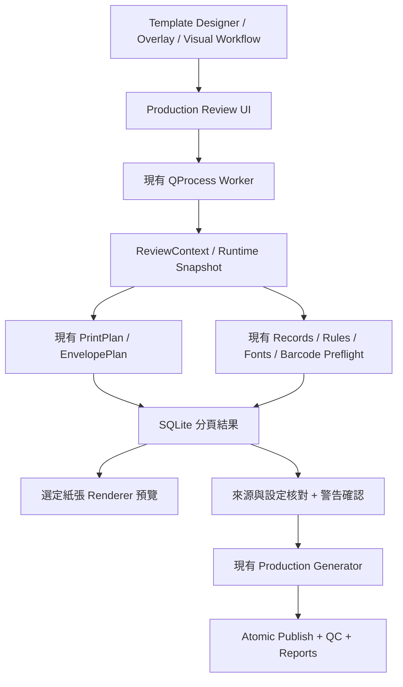

# Production Review — 開發功能與驗收

基線：v3.0.3。此文件描述開發分支的實作，未宣稱已有新安裝包。

## 操作

1. Template Designer／PDF Overlay 設定資料、模板、雙面、Barcode 及 Media，按 **Generate PDF** 或 **Review Production…**。
2. Workflow 先完成既有 Check／Review／Approve，再使用 **Review Production**、Run Ready Jobs 或 Review production。
3. 選輸出資料夾，背景準備及檢查完整生產輸入。檢查時可切換應用程式模式，不會取消工作。
4. Summary 核對數量、輸出名稱、紙張及 backend。Mailpieces 每頁 50 筆，Enter 搜尋資料；可按封號／輸出頁跳轉。
5. 選一封及一頁，Paper sheets 顯示該實體紙的正反面，包含補白背面。Fit 顯示整頁，亦可放大。Barcode values 顯示目前所選面之 payload、各段、物件尺寸及位置。
6. Issues 可返回設定或對應 Template Designer 物件。Paper sheets 的 **Open source PDF at this page** 使用 PDF Workspace 異步開檔及定位；Workflow 使用原始 PDF／頁碼對照。自動字體替代可開啟檢查 CSV。
7. 修正設定後 **Check again**。警告須明確勾選已覆核；全量檢查完成且沒有錯誤才可 **Confirm production**。
8. 正式生成返回原有 Production／Run 頁，沿用原有 atomic output、解碼、驗證、reconciliation 及報告。

所有覆核只供本次工作階段使用。關閉程式後不恢復批准，也不自動續跑。檢查取消會阻止批准；已完成工作仍可核對。

## 共用架構

### 實作對照

| 模組 | 責任／重用 |
|---|---|
| `composition/review/model.py` | Runtime ReviewContext、ReviewIssue、ReviewSnapshot；不加入 saved-project schema。 |
| `composition/review/service.py` | 全量檢查、來源雜湊、SQLite 逐封逐頁記錄、50 筆分頁、單紙預覽、確認核對。 |
| `composition/review/ui.py` | 共用只讀 pane 與 controller；保留 worker 到 ended；最新選取為準，限制重複 view workers。 |
| `composition/designer/production_review.py` | Template Designer／Overlay 入口、返回設定、凍結 ProductionJob。 |
| `workflow/production_review.py` | 已批准 batch／branch 與接受的 PDF Workflow 轉成共用 ReviewContext；驗證工作清單及每工作 signature。 |
| `composition/worker.py`、`workflow/worker.py` | 重用現有 isolated worker transport；正式生成前重新驗證 review receipt。 |
| `composition/media/planner.py`、`composition/pdf_source/planner.py` | 唯一紙張／補白／正反面計畫，亦用於覆核；未另建計算器。 |
| `composition/data/sequences.py`、`composition/engine/*`、`composition/overlay/renderer.py` | 重用流水號、宣告式規則、字體檢查、條碼 payload／尺寸及同一 renderer。 |
| `workflow/pdf_pipeline.py` | 覆核準備篩選／排序後的資料及 PDF；正式生成使用同一凍結專案、provider、Job ID、命名及原始來源對照。 |

## 安全及相容邊界

- Scratch 只放所屬工作區的 `production-review/<snapshot-id>/`，包含 SQLite、snapshot、字體檢查 CSV 及選定紙張 PNG。覆核不呼叫 generator，亦不建立正式輸出資料夾。
- 正式生成的 Job ID、時間與 variable context 在覆核前凍結。來源及明確資產以 SHA-256 + size／mtime 核對，檢查結束再確認；生成前重新雜湊，包含 size／mtime 未變的內容改動。
- 草稿／設定修改及取消不能透過切換工作、勾選警告或重新點按來恢復舊確認。未完成、錯誤及過期結果不能批准。
- Workflow 原有資料／分封批准保留，覆核不呼叫 approve。第一次只選輸出資料夾時保留有效資料批准，生產覆核仍需完成；其他資料／模板設定變更沿用既有重新檢查要求。
- Batch／branch 生成核對所有 Ready + approved 工作、signature 及輸出根目錄；不能以只覆核其中一項的 receipts 執行另一批工作。
- 無新增依賴，核心服務匯入不載入 Qt。公開版本、`.pdcx`、`.pdflow`、Overlay、Barcode profiles 格式及 installer/update 流程均不變。
- 預覽是 renderer 輸出及計畫 payload，沒有聲稱提前完成成品解碼或實機驗證。Printer／Inserter physical acceptance 仍由操作員另行確認。
- 本輪不加入 Job History、reprint、重啟恢復或新的生產引擎。大量頁面結果在 SQLite，不全量載入 GUI；正反面只渲染被選中的一張紙。

## 針對性驗收

| 檢查 | 證據 |
|---|---|
| 三頁雙面 × 兩筆 | 8 輸出頁、4 張紙、2 張補白背面、4 個正面 I25；覆核 payload 與正式解碼 CSV 相同。 |
| Group／Sheet 循環 | 101 封逐筆核對 `99 → 00`；Job sheet 保留完整紙序，兩筆雙面補白後索引正確。 |
| Media | PDF + PS／PDF + JDF 共用原有四頁雙面兩紙種計畫；正反面紙種衝突阻止確認，檢查不產生 PS／JDF。 |
| 全量與分頁 | 10,000 筆全量檢查，GUI 查詢最後 50 筆；72 頁一封跳至頁 65 只讀取所需 50 頁區段。 |
| Fonts | 缺字定位 Record 2、物件及 Name 欄；明確 auto repair 後有替代數量及 CSV，警告須確認。 |
| 來源一致性 | 來源內容變動但保持 size／mtime，生成前仍被拒絕；模板設定更改、取消及未完成不能確認。 |
| Workflow | 多模板 batch、六個分支工作、篩選後 PDF 跑通；保留原始 record／PDF page，覆核不批准或發布。 |
| UI | 真正 QProcess 檢查／確認／生成、返回 Production Review、960×640、480×320、深淺色及 200% Qt scaling。 |
| 既有流程 | 原有多頁模板、Overlay、I25、Workflow、模式切換相关測試保留實際 PDF 驗收；更新測試只增加必要覆核確認。 |

### 本輪驗收紀錄（2026-10-09）

- 11 個相關模組：最新結果共 **138 tests passed**，無失敗、錯誤或略過。模式切換測試更新為先覆核再確認生成，保留原有 PDF 內容與背景任務驗收。
- Workflow 核心、資料整理、節點檢查及分支引擎：**91 tests passed**。
- 共用覆核 UI 在 `QT_SCALE_FACTOR=2` 下：**8 tests passed**；亦檢查 960×640 深淺色截圖。
- 另核對 Excel、流水號、自動字體替代、跨模式背景生成及來源交接的原有生成案例。退出時 Undo 訊號可能存取已刪除 Qt 控制項的問題已修正，來源交接案例正常結束。
- Ruff 與 `git diff --check` 通過。所有測試仍保留實際產物／狀態斷言，沒有停用失敗測試。
- 測試日誌、JUnit 及最新結果彙總保存在本機 `production-review/validation` 驗收資料夾；初次失敗與修正後重跑紀錄均保留。

完整回歸、Windows 打包／安裝 smoke test 及新版本發佈留待統一驗收；本機生成合成 fixtures 的結果不代表所有客戶文件或硬件均已驗證。
