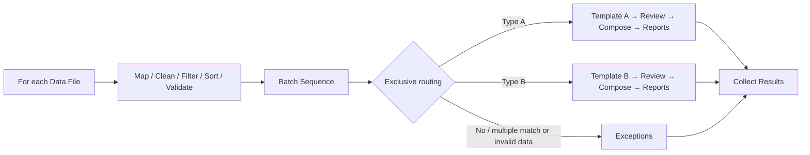

# Mail Merge v5: implementation note

## Architecture review (M0)

The current `WorkflowSpec` and its canvas assume one outgoing connection per
node; `batch.prepare` pairs exactly one template and one input per job. Reusing
`spec.node(kind)` for a branched graph would select the wrong template. The v5
graph therefore has its own validator/compiler and worker operations. v1–v4
continue to use their current engine and inspection operations unchanged.

The new graph is a bounded For-each source, one common preparation chain, one
batch sequence, one exclusive route node, linear template branches, an exception
sink and a results collector. Named ports are represented by v5 edges containing
`source`, `target`, `port`. Cycles and nested routing are rejected. Runtime
identity is source item + branch + node; original record identities remain in a
SQLite reconciliation ledger. The UI reads 50 rows at a time.

Partitions are streamed to workspace-only CSV files for reuse of the existing
headless batch snapshot/check/generate APIs. Templates are copied into the
workspace with imported record mode; customer templates are never edited. No
rendering engine depends on Qt. A branch job is checked and explicitly approved
before generation. Normal records may be approved only after acknowledging the
exception and blocked-source summary. Completed valid jobs are retained during
retry; no automatic background resume or publication is introduced.

Global record sequence follows the ordered source list and each source's filtered
and sorted records. Exception rows reserve their sequence. Changing common
settings/sources invalidates the sequence; branch template/media settings
invalidate affected jobs. No printer access or new dependencies are needed.

Milestones: M1 graph/data contracts; M2 headless routing/reconciliation; M3
workspace/data input; M4 inspection/approval/production; M5 targeted scale/UI and
regression checks. This maps the requested M0–M4 product stages into reviewable
commits. Full packaging/public release is deferred until the user requests it.

## Operator guide

1. Document Designer → Create Visual Workflow → **Conditional Mail Merge**.
   The homepage also offers **For each file → Route by template**.
2. Select **For each Data File**. Add files or capture a folder once, select
   import settings/worksheet per file and reorder the source list as needed.
   Excel imports use the existing formula/leading-zero policy.
3. Add common Clean/Create/Filter/Sort/Validate steps. Numeric conditions use
   decimal comparison. Unique checks cover both within-file and cross-file
   duplicates. Apply settings; invalid drafts stay attached to their node.
4. Configure **Batch Sequence** (default `WorkflowSeq`, 1, increment 1, six
   digits). Templates reference `{{WorkflowSeq}}` as a normal merge field.
   Filtering/sorting precede this step. Exceptions reserve numbers; excluded
   records have no sequence. A failed unreadable source is explicitly reported;
   sequence is assigned only to records imported from the readable sources.
5. Configure named routes with All/Any conditions. Choose each saved `.pdcx`
   template. The starter Letters route is an **explicit fallback**; replace it
   with conditions when required. At most one fallback is permitted. A record
   must match exactly one conditional route, or the fallback when none match.
6. Templates may have different fixed page counts. Edit layout in Template Designer;
   select **Configure print media…** on the template to add a media node for
   that branch. Existing stock/profile, PDF+PS and PDF+JDF services are reused.
7. **Check to step** inspects the reachable prefix without publishing.
   **Check & Preview** checks the full graph, freezes child inputs and scans
   fonts/rules for all routed records. Record preview renders one selected
   branch record/page, independently from production.
8. Inspect **Settings / Input / Output / Issues**. Each evidence page contains
   at most 50 rows, with bounded value previews and original source row/record
   identities. Select a source or search and press Enter. Sort order is shown
   without changing source identities. Issues identify the validation node.
9. **Review & approve** explicitly approves checked branches. To deliver normal
   records despite exceptions/blocked items, first review them and select
   **Accept partial production**. This does not approve invalid records.
10. **Run approved** creates a batch folder containing independent child-job
    outputs and `record-reconciliation.csv`, `exceptions.csv`,
    `batch-summary.csv`, `run.json`. Child packages contain existing PDF/media
    files and their own job/control reports. The record CSV includes source file,
    original record, sequence, branch and output PDF/page range. `published`
    means a verified PDF was published; it does not claim a physical print.
    No PDFs are automatically combined.

## Compatibility and production behavior

- New v5 recipes store named edge ports, a fixed source list and declarative
  conditions. v1–v4 remain on their existing linear implementation.
- `.pdcx` schema and public application version are unchanged. Saving a v5
  recipe copies referenced templates/assets; data files remain external links.
  Source passwords or imported data contents are not embedded in the recipe.
- There are no graph cycles, nested routing, arbitrary Python expressions,
  hot folders, background resume or PDF-grouping branches. Maximum graph size
  is 64 nodes / 128 edges, at most 12 routes and 10,000 explicitly listed files.
- A template/media change makes that branch's evidence stale. Rechecking
  retains valid completed siblings. Source, order or common settings changes
  invalidate the batch sequence. Changing node position alone does not.
- Cancel uses safe checkpoints. Completed files remain valid; unpublished
  child outputs use the existing cleanup policy. Cancelled checks cannot approve
  production. Source/branch fingerprints and frozen child hashes are rechecked.
- Rendering errors stop the affected child; other independent child outputs
  are retained. Reconciliation never reports partial delivery as plain Completed.

## Validation

Targeted tests cover three input files × two templates, sequence reservation,
exclusive/fallback/ambiguous routing, cross-file uniqueness, node attribution,
mapping and stable source identity after sorting/filtering, disconnected prefix
checks, missing files, retained completed siblings, actual PDF generation,
Qt drafts/Undo, paging, embedding, theme and compact layout.

Run `scripts/benchmark_workflow_branches.py` for fresh-process benchmarks at
1,000 / 10,000 / 50,000 records; `--production` additionally generates PDFs.
`scripts/qa_workflow_branches.py` renders deep/light theme evidence at 1280×800
and 960×640; set `QT_SCALE_FACTOR=2` for 200% scale. Offline QA explicitly loads
the bundled UI font because Qt's offscreen backend does not list Windows fonts.
Benchmark fixtures are synthetic local CSV/text, not guarantees for network,
   image-heavy/CJK customer documents or physical printer tray selection.
